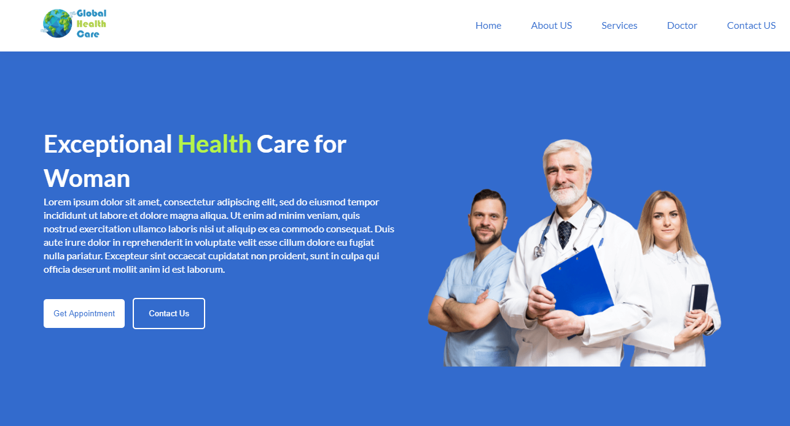

# Project-5-GlobalHealthCare-V-1.0

Global Health Care Website is Exceptional Health Care for Woman

Health care, health-care, or healthcare is the maintenance or improvement of health via the prevention, diagnosis, treatment, recovery, or cure of disease, illness, injury, and other physical and mental impairments in people. Health care is delivered by health professionals in allied health fields. Physicians and physician associates are a part of these health professionals. Dentistry, pharmacy, midwifery, nursing, medicine, optometry, audiology, psychology, occupational therapy, physical therapy, athletic training and other health professions are all part of health care. It includes work done in providing primary care, secondary care, and tertiary care, as well as in public health.

Access to health care may vary across countries, communities, and individuals, influenced by social and economic conditions as well as health policies. Providing health care services means "the timely use of personal health services to achieve the best possible health outcomes".[2] Factors to consider in terms of healthcare access include financial limitations (such as insurance coverage), geographic barriers (such as additional transportation costs, possibility to take paid time off of work to use such services), and personal limitations (lack of ability to communicate with healthcare providers, poor health literacy, low income).[3] Limitations to health care services affects negatively the use of medical services, the efficacy of treatments, and overall outcome (well-being, mortality rates).

Health care systems are organizations established to meet the health needs of targeted populations. According to the World Health Organization (WHO), a well-functioning health care system requires a financing mechanism, a well-trained and adequately paid workforce, reliable information on which to base decisions and policies, and well maintained health facilities to deliver quality medicines and technologies.[4]

An efficient health care system can contribute to a significant part of a country's economy, development, and industrialization. Health care is conventionally regarded as an important determinant in promoting the general physical and mental health and well-being of people around the world. An example of this was the worldwide eradication of smallpox in 1980, declared by the WHO as the first disease in human history to be completely eliminated by deliberate health care interventions.[5]

